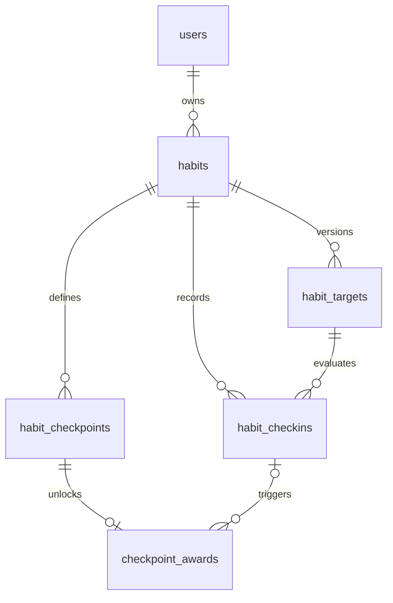

# Habit Tracker — Technical Implementation Plan

## 1. Purpose and scope

Build a responsive habit-tracking web application inspired by the supplied mobile UI: a near-black canvas, softly tinted habit cards, rounded controls, per-habit accent colors and icons, compact calendar heatmaps, streak indicators, and a prominent daily action.

The first releasable version must let an authenticated user:

1. Create, edit, archive, and reorder a habit.
2. Define a measurable target and schedule for that habit.
3. Define one or more checkpoints and the reward earned at each checkpoint.
4. See a daily heatmap for every habit.
5. Check in for today or any past day and attach or edit that day's note.
6. See target progress, streaks, checkpoint progress, and earned rewards calculated consistently from check-ins.

The reference image also contains wallpaper and reminder navigation. Those are not part of the requested first release. The web navigation should instead use **Habits**, **Calendar**, **Rewards**, and **Settings**, retaining the visual treatment without implying unsupported features.

## 2. Product decisions

These defaults make the first implementation unambiguous while preserving room to expand:

- A user owns many habits; habit data is never shared between users in v1.
- A calendar day is defined in the user's IANA timezone, not by UTC midnight.
- There is at most one check-in record per habit and local date.
- A check-in may contain a value, a note, or both. This permits a note on an incomplete or skipped day.
- Targets can be binary, quantity-based, or duration-based and can apply daily or weekly.
- Daily targets may run every day or on selected weekdays. Weekly targets aggregate all entries in the user's Monday-to-Sunday week.
- Changing a target creates a new effective-dated target version. It never changes whether an old entry met its historical target.
- Daily target changes may take effect today; weekly target changes take effect on the next Monday so one week is never evaluated against two rules. If today's daily entry already exists, it is rebound to the new target in the same transaction and its derived progress is recalculated.
- A streak counts consecutive **scheduled target periods**, not raw calendar days. For a weekly target, a streak is measured in completed weeks.
- Checkpoints are one-time milestones based on completed periods, current streak, or accumulated value.
- Once a reward has been earned it remains in the reward history, even if an old check-in is later edited. This makes reward history predictable; a future administrative reversal can be added separately.
- Habits are archived rather than hard-deleted in normal UI flows.
- Future check-ins are disallowed. Past dates on or after the habit's start date remain editable.

## 3. UX and visual system

### 3.1 Application shell

- Mobile: fixed rounded bottom dock, safe-area padding, single-column cards, and a sticky top bar.
- Tablet/desktop: centered content with a maximum readable width; the dock becomes a left rail or compact top navigation, while habit cards can use one or two columns.
- Header: list/grid filter control on the left, `Habits` title, and a large circular add button on the right.
- Empty state: a low-contrast illustrated card with a single `Create your first habit` action.

### 3.2 Theme tokens

Use CSS custom properties and semantic tokens rather than hard-coded component colors:

```css
--canvas: #050505;
--surface: #1c1c1e;
--surface-raised: #292a2d;
--text-primary: #f7f7f7;
--text-muted: #8d9299;
--cell-empty: #24282a;
--focus-ring: #f7f7f7;
```

Each habit stores a token name such as `emerald`, `azure`, `amber`, `violet`, or `rose`, not an arbitrary CSS value. The card background uses a subtle accent tint, the border uses a stronger tint, and the icon, completed heatmap cells, progress, and checkmark use the full accent. This keeps contrast controlled and prevents unsafe style injection.

Color must not be the only signal. Complete cells have a check affordance in detail views, skipped cells use a dash pattern, and cells with notes have a small note marker.

### 3.3 Habit card

Each card contains:

- habit icon, name, start date, and elapsed-day label;
- current streak pill (`🔥 5`) with an accessible label describing the unit;
- a 7-row heatmap with weekday labels and horizontally scrollable week columns;
- today's progress (`8 / 8 glasses`, `30 / 45 min`, or `Checked in`);
- a full-width check-in button using the habit accent;
- checkpoint summary, e.g. `Day 24 of 30 · Movie night reward`, when a checkpoint is active.

Clicking a card header opens the habit detail page. Clicking a heatmap cell opens that date in the check-in drawer. For a binary habit, today's main button performs an optimistic one-tap check-in and offers `Add note`; quantity and duration habits open a stepper/editor.

### 3.4 Create/edit habit flow

Use a mobile bottom sheet and a desktop dialog or dedicated route with three visible sections:

1. **Habit:** name, optional description, icon, accent, start date.
2. **Target:** binary/count/duration, target amount, unit, daily/weekly cadence, scheduled weekdays where applicable.
3. **Checkpoints:** repeatable rows containing milestone metric, threshold, checkpoint title, and reward description.

Show a live card preview. Validate inline and preserve entered data if submission fails. Creating the habit, initial target, and checkpoints is one database transaction.

When editing a target, show the effective date before confirmation. Daily changes default to today. Weekly changes show the next Monday and keep the existing target active through Sunday.

### 3.5 Daily check-in drawer

The drawer includes:

- selected local date and scheduled/not-scheduled context;
- completion toggle for binary habits or numeric/duration input for measurable habits;
- progress relative to the target effective on that date;
- `Skipped` option that sets value to zero without requiring a note;
- note field with a 2,000-character limit;
- `Save`, `Clear progress`, and `Delete entry` as distinct actions so clearing a value does not accidentally erase a note.

After save, update the cell, card progress, streak, and checkpoint summary from the server response. Announce the result through an ARIA live region and move focus back to the triggering control when the drawer closes.

### 3.6 Habit detail and supporting views

- `/habits/[habitId]`: full-year heatmap, check-in editor, current target, target history, statistics, checkpoints, and reward history.
- `/calendar`: all habit entries for one selected day; useful for batch daily check-in.
- `/rewards`: upcoming checkpoints followed by earned rewards and earned dates.
- `/settings`: timezone, week start (fixed to Monday in v1 UI but modeled cleanly), reduced motion, and account actions.

## 4. Recommended architecture

This is a greenfield workspace. Use a modular monolith so business rules remain testable without introducing distributed-system overhead.

### 4.1 Baseline stack

- **Web:** Next.js App Router, React, and TypeScript.
- **Styling:** Tailwind CSS plus CSS variables for semantic theme tokens.
- **Forms/validation:** React Hook Form and shared Zod schemas.
- **Database:** PostgreSQL with Drizzle ORM and checked-in SQL migrations.
- **Authentication:** Auth.js-compatible session authentication; keep domain ownership independent of the specific login provider.
- **Dates:** `date-fns` plus explicit timezone conversion utilities. Domain functions receive `localDate` and `timezone`; they must not depend on the server's timezone.
- **Tests:** Vitest for domain and integration tests, Testing Library for components, and Playwright for user journeys.

Do not introduce a client-wide state manager initially. Server-render the dashboard projection, use local component state for open drawers/forms, and use optimistic mutations only for bounded check-in actions.

### 4.2 Module boundaries

```text
src/
  app/
    (auth)/
    (tracker)/
      page.tsx
      calendar/page.tsx
      rewards/page.tsx
      habits/new/page.tsx
      habits/[habitId]/page.tsx
    api/
  components/
    habit-card/
    heatmap/
    check-in/
    habit-form/
    checkpoints/
    shell/
  domain/
    habits/
    targets/
    check-ins/
    streaks/
    checkpoints/
    calendar/
  server/
    auth/
    services/
    repositories/
  db/
    schema/
    migrations/
    seed/
  styles/
```

Rules in `domain/` are pure TypeScript and have no React, request, ORM, or system-clock dependencies. `server/services/` owns authorization, transactions, and orchestration. Route handlers and server components call services rather than querying tables directly.

## 5. Database design

### 5.1 Relationship overview



Authentication-provider account/session tables are intentionally omitted from the domain diagram.

### 5.2 `users`

| Column | Type | Notes |
| --- | --- | --- |
| `id` | UUID PK | Generated server-side |
| `email` | CITEXT UNIQUE | Authentication identity |
| `display_name` | TEXT NULL | Optional |
| `timezone` | TEXT | Valid IANA name, e.g. `Asia/Ho_Chi_Minh` |
| `created_at`, `updated_at` | TIMESTAMPTZ | UTC timestamps |

### 5.3 `habits`

| Column | Type | Notes |
| --- | --- | --- |
| `id` | UUID PK | |
| `user_id` | UUID FK | References `users`, indexed |
| `name` | VARCHAR(80) | Required |
| `description` | VARCHAR(500) NULL | |
| `icon` | VARCHAR(32) | Value from a controlled icon/emoji set |
| `accent_token` | VARCHAR(24) | Whitelisted theme token |
| `start_date` | DATE | User-local date |
| `archived_at` | TIMESTAMPTZ NULL | Soft delete |
| `sort_order` | INTEGER | Stable dashboard ordering |
| `created_at`, `updated_at` | TIMESTAMPTZ | |

Index active dashboard reads on `(user_id, archived_at, sort_order)`.

### 5.4 `habit_targets`

Targets are effective-dated so a habit can evolve without rewriting history.

| Column | Type | Notes |
| --- | --- | --- |
| `id` | UUID PK | |
| `habit_id` | UUID FK | Indexed |
| `metric` | ENUM | `binary`, `count`, `duration` |
| `target_value` | NUMERIC(12,2) | `1` for binary; must be positive |
| `unit` | VARCHAR(32) NULL | `glasses`, `pages`, `minutes`, etc. |
| `cadence` | ENUM | `daily`, `weekly` |
| `scheduled_weekdays` | SMALLINT[] NULL | ISO 1–7; null means every day; relevant to daily cadence |
| `effective_from` | DATE | Inclusive |
| `effective_to` | DATE NULL | Inclusive; null means current |
| `created_at` | TIMESTAMPTZ | |

Invariants:

- Target ranges for a habit cannot overlap.
- The first target begins on the habit start date.
- There can be only one open-ended target per habit; it may be a scheduled weekly target whose effective date is the next Monday.
- Binary targets have value `1` and no free-form unit.
- Editing a target closes the previous row on the day before the new row starts and inserts a new row in the same transaction.
- Daily changes cannot be backdated before today. If today's entry exists, update its `target_id` to the replacement target and recalculate derived progress transactionally. Weekly changes must start on an ISO Monday and cannot rewrite the current or a prior week.
- Target rows referenced by check-ins are never deleted.

Use an application transaction plus database constraints. If range types are acceptable in the chosen hosting environment, add a PostgreSQL exclusion constraint over `daterange(effective_from, effective_to, '[]')` by `habit_id` to prevent overlaps under concurrency.

### 5.5 `habit_checkins`

| Column | Type | Notes |
| --- | --- | --- |
| `id` | UUID PK | |
| `habit_id` | UUID FK | |
| `target_id` | UUID FK | Target effective on `local_date` |
| `local_date` | DATE | The user's intended calendar day |
| `value` | NUMERIC(12,2) | Non-negative; zero is allowed |
| `is_skipped` | BOOLEAN | If true, value must be zero |
| `note` | VARCHAR(2000) NULL | May exist when value is zero |
| `checked_at` | TIMESTAMPTZ NULL | Last positive check-in time; null for note-only entries |
| `created_at`, `updated_at` | TIMESTAMPTZ | |

Constraints and indexes:

- Unique `(habit_id, local_date)` makes writes idempotent.
- Index `(habit_id, local_date DESC)` for heatmap range reads.
- Reject dates before the habit start date or after the user's current local date.
- Reject a `target_id` that belongs to a different habit or is not effective for `local_date`.
- Preserve a row with value zero if it has a note or is explicitly skipped; remove an entirely empty row.

The UI state is derived, not independently stored:

- `skipped`: `is_skipped = true`;
- `complete`: a daily entry meets its daily target, or a positive weekly-target contribution belongs to a week whose final aggregate meets that target;
- `partial`: positive value below the applicable target;
- `note-only`: zero value with a note;
- `missing`: no row.

### 5.6 `habit_checkpoints`

| Column | Type | Notes |
| --- | --- | --- |
| `id` | UUID PK | |
| `habit_id` | UUID FK | |
| `title` | VARCHAR(80) | e.g. `First month` |
| `metric` | ENUM | `completed_periods`, `current_streak`, `total_value` |
| `threshold_value` | NUMERIC(12,2) | Positive |
| `reward_description` | VARCHAR(500) | e.g. `Buy a new book` |
| `sort_order` | INTEGER | |
| `created_at`, `updated_at` | TIMESTAMPTZ | |

Validate compatible metrics: `total_value` is useful for count/duration targets; `completed_periods` and `current_streak` work for every target type. Duplicate thresholds are allowed only if titles differ, but the UI should warn because they unlock together.

### 5.7 `checkpoint_awards`

| Column | Type | Notes |
| --- | --- | --- |
| `id` | UUID PK | |
| `checkpoint_id` | UUID FK UNIQUE | One award per checkpoint |
| `trigger_checkin_id` | UUID FK NULL | Entry whose mutation crossed the threshold |
| `progress_snapshot` | NUMERIC(12,2) | Progress at award time |
| `earned_at` | TIMESTAMPTZ | Immutable event time |

Incomplete checkpoints are reevaluated after any check-in mutation. Insert awards with `ON CONFLICT DO NOTHING` inside the check-in transaction so retries and concurrent writes cannot award twice.

## 6. Domain calculations

### 6.1 Target resolution

`targetForDate(habitId, localDate)` selects the one target whose effective range contains the date. All writes resolve this server-side; clients cannot nominate an arbitrary target ID.

### 6.2 Daily and weekly completion

- Daily: a scheduled date is complete when its entry value is at least the target value.
- Weekly: sum non-skipped values from local Monday through Sunday and compare with the target. The card displays current-week progress. A missing day remains missing even when the week succeeds; only positive contribution cells receive a completed-week treatment, so the heatmap never invents check-ins.
- An unscheduled daily date is neutral and does not break or extend a streak.
- A skipped scheduled period is incomplete and breaks a streak.
- Values above target remain stored but visual intensity caps at 100%.

### 6.3 Streak semantics

Evaluate periods backward from the current local period:

1. If today's/current week's target is complete, include it and continue backward.
2. If the current period is still in progress, start from the previous scheduled period so the user does not lose a streak prematurely.
3. Stop at the first incomplete scheduled period or the habit start date.

Expose both `currentStreak` and `longestStreak`; label the unit as days or weeks. Unit-test DST changes, selected weekdays, target version boundaries, and a not-yet-complete current period.

### 6.4 Heatmap projection

The server returns check-ins for an explicit inclusive date range plus target versions needed for that range. A pure calendar projector produces one cell per date:

```ts
type HeatmapCell = {
  date: string; // YYYY-MM-DD local date
  state: 'future' | 'unscheduled' | 'missing' | 'note-only' | 'partial' | 'complete' | 'skipped';
  value: number;
  targetValue: number | null;
  intensity: 0 | 1 | 2 | 3 | 4;
  hasNote: boolean;
  label: string;
};
```

Rows are ISO weekdays and columns are Monday-based weeks. The dashboard loads at most the most recent 366 days once; CSS/container logic exposes roughly 26 weeks on compact cards and up to 52 weeks when space permits, with horizontal scrolling for the remainder. Future cells are disabled. Every cell is a real button with a complete accessible label such as `12 August 2026, 6 of 8 glasses, note added`.

## 7. API and service contracts

Use route handlers as a thin HTTP boundary over application services. Every service receives the authenticated `userId`; repository queries scope through `habits.user_id` to prevent cross-account access.

### 7.1 Dashboard/read endpoints

- `GET /api/dashboard?from=YYYY-MM-DD&to=YYYY-MM-DD`
  - returns active habits, effective targets, range check-ins, today's progress, streaks, and next checkpoint in one projection;
  - validates the requested range and caps it to 366 days;
  - avoids one query per card.
- `GET /api/habits/:habitId`
  - returns detail, target history, entries for the requested range, checkpoints, and awards.

### 7.2 Habit and target mutations

- `POST /api/habits`: create habit, first target, and optional checkpoints transactionally.
- `PATCH /api/habits/:habitId`: edit presentation fields, reorder, or archive.
- `POST /api/habits/:habitId/targets`: create a new effective target version.
- `POST/PATCH/DELETE /api/habits/:habitId/checkpoints`: manage unearned checkpoints; preserve awarded checkpoint history.

### 7.3 Check-in mutations

- `PUT /api/habits/:habitId/checkins/:localDate`: idempotently upsert value, skipped state, and/or note.
- `PATCH /api/habits/:habitId/checkins/:localDate/progress`: alter value without changing note.
- `DELETE /api/habits/:habitId/checkins/:localDate`: delete the complete entry after explicit confirmation.

The upsert service:

1. authenticates and authorizes habit ownership;
2. validates local date against the user's timezone and habit start date;
3. resolves the target effective on that date;
4. locks or atomically upserts the unique habit/date row;
5. recalculates incomplete checkpoints and inserts newly earned awards;
6. commits once;
7. returns the updated cell, today's progress, streaks, checkpoint progress, and newly earned rewards.

Return structured validation errors, use `404` for resources outside the user's ownership boundary, and include `updated_at` in mutation responses for stale-write detection. Never log note contents.

## 8. Component and data-flow plan

### 8.1 Key components

- `AppShell`, `TopBar`, `ViewToggle`, `BottomDock`
- `HabitList`, `HabitCard`, `HabitIcon`, `StreakPill`, `TodayProgress`
- `HabitHeatmap`, `HeatmapWeek`, `HeatmapCell`, `HeatmapLegend`
- `CheckInDrawer`, `QuantityStepper`, `DurationInput`, `NoteEditor`
- `HabitForm`, `TargetFields`, `WeekdayPicker`, `CheckpointBuilder`, `HabitPreview`
- `CheckpointProgress`, `RewardCelebration`, `RewardHistory`

### 8.2 Read flow

The dashboard server component loads a single dashboard projection. Interactive cards receive serializable data. Date labels are rendered from `localDate` values, and hydration must use the same user timezone to avoid server/client day mismatches.

### 8.3 Mutation flow

Use optimistic state only where rollback is obvious:

- Binary today check-in toggles immediately, disables repeat submission, then reconciles with the server response.
- Quantity, duration, historical dates, and notes save through the drawer and update after success.
- A failed optimistic mutation restores the prior card projection and keeps the note draft available.
- A newly earned reward opens a reduced-motion-aware celebration after the transaction succeeds, never before.

## 9. Security, accessibility, and reliability

### 9.1 Security and privacy

- Check authentication and habit ownership inside every service, not only in page middleware.
- Validate all request bodies and route params with shared schemas.
- Use same-site, secure, HTTP-only session cookies and framework CSRF protections for mutations.
- Render notes as text; never accept or render HTML.
- Rate-limit write endpoints by authenticated user and route.
- Do not expose whether another user's UUID exists; return the same not-found response.
- Exclude note bodies and authentication data from analytics, logs, and error context.

### 9.2 Accessibility

- Meet WCAG AA contrast for text, focus, and all cell states.
- Provide 44×44 CSS-pixel primary touch targets; heatmap cells may be visually smaller but need an expanded interactive hit area in detail mode.
- Support keyboard heatmap navigation with arrow keys, Home/End, and Enter/Space.
- Add accessible names containing date, value, target, state, and note presence.
- Trap focus in dialogs/drawers and restore it on close.
- Respect `prefers-reduced-motion`; reward feedback cannot depend on animation.

### 9.3 Performance and operations

- Budget the initial dashboard for one aggregate read path and no N+1 queries.
- Paginate or range-limit detail history; cap heatmap reads at 366 days.
- Cache immutable icon/theme assets; do not publicly cache personalized API responses.
- Run migrations as a separate deployment step and take a database backup before destructive schema changes.
- Add structured error reporting, request IDs, database health checks, and metrics for mutation latency/error rate.
- Seed a deterministic development account containing binary, quantity, and duration habits matching the green/blue/orange visual examples.

## 10. Test strategy

### 10.1 Domain unit tests

- target resolution before, on, and after a version boundary;
- daily and weekly completion, partial progress, skipped periods, and over-target values;
- selected weekdays and unscheduled days;
- current/longest streak with an incomplete current period;
- timezone and DST boundaries using fixed clocks;
- heatmap week alignment, leap days, future cells, intensity, and note markers;
- checkpoint progress and one-time award eligibility.

### 10.2 Database/service integration tests

- habit + target + checkpoints commit or roll back together;
- target ranges cannot overlap under concurrent requests;
- check-in upsert is unique and idempotent for habit/date;
- note-only and skipped rows persist correctly;
- clearing progress preserves a note;
- target ID is selected server-side and historical entries keep historical semantics;
- concurrent threshold-crossing writes create one award;
- every read and mutation rejects a second user's habit ID;
- archived habits disappear from the active dashboard but retain history.

Run integration tests against PostgreSQL, not an in-memory substitute, because ranges, arrays, numeric constraints, uniqueness, and locking are part of the contract.

### 10.3 Component tests

- create form reveals the correct fields for each target type and announces errors;
- heatmap cells expose complete accessible labels and keyboard behavior;
- binary optimistic check-in rolls forward and back correctly;
- check-in drawer preserves drafts after a server error;
- checkpoint builder adds, reorders, validates, and removes rows;
- mobile/desktop navigation exposes the same destinations.

### 10.4 Playwright acceptance journeys

1. Create a daily binary `Study` habit with a 7-day reward; verify its themed card appears.
2. Create `Drink water` with a target of eight glasses; add quantities until the card shows `8 / 8`.
3. Open a past heatmap day, check in, save a note, reload, and verify both progress and note marker persist.
4. Edit that past entry and verify its heatmap intensity and streak recalculate.
5. Cross a checkpoint threshold, verify one celebration and one reward-history record, then retry the request and verify no duplicate award.
6. Change a target effective today and verify a past date still uses the prior target.
7. Verify an unscheduled day does not break a streak and a skipped scheduled day does.
8. Attempt direct access to a second user's IDs and verify no data disclosure.
9. Complete the core flow using keyboard only at mobile and desktop viewport sizes.

## 11. Ordered implementation plan

### Phase 0 — Foundation

1. Scaffold the TypeScript web app, linting, formatting, tests, environment validation, and CI.
2. Establish semantic CSS tokens, font scale, layout shell, icons, and responsive navigation.
3. Configure PostgreSQL, ORM migrations, test database isolation, authentication, and fixed-clock helpers.

**Exit gate:** CI runs lint, typecheck, unit tests, integration tests, and a Playwright smoke test; an authenticated empty dashboard renders on mobile and desktop.

### Phase 1 — Domain and persistence

1. Add enums, tables, constraints, indexes, migrations, and deterministic seeds.
2. Implement pure target resolution, completion, schedule, streak, heatmap, and checkpoint functions test-first.
3. Implement repositories and ownership-scoped services.

**Exit gate:** database/service tests prove uniqueness, target history, timezone-safe dates, ownership isolation, and idempotent awards.

### Phase 2 — Habit creation and editing

1. Build the habit form, target fields, weekday picker, checkpoint builder, and card preview.
2. Add transactional create, presentation edit, target-version edit, reorder, and archive services/routes.
3. Add empty, loading, validation, conflict, and retry states.

**Exit gate:** a user can create all three target types with checkpoints, edit without rewriting history, reorder, and archive.

### Phase 3 — Check-ins and notes

1. Build the date-aware check-in drawer and inputs for binary/count/duration targets.
2. Implement idempotent upsert, clear-progress, delete-entry, and checkpoint-award transaction flows.
3. Add binary optimistic today check-in and robust rollback behavior.

**Exit gate:** today and past-day entry/note flows survive reload, target resolution is historical, retries do not duplicate data, and all negative paths have tests.

### Phase 4 — Dashboard and heatmaps

1. Implement the aggregate dashboard projection and responsive habit cards.
2. Build the accessible 7-row heatmap, state legend, note markers, and day editor link.
3. Add streak pills, today progress, list/grid modes, loading skeletons, and empty states.

**Exit gate:** all active habits render without N+1 queries; heatmap, card progress, streak, and notes reconcile after every mutation on mobile and desktop.

### Phase 5 — Checkpoints, rewards, and detail views

1. Add next-checkpoint progress to cards and checkpoint management to habit detail.
2. Build idempotent reward celebration and permanent reward history.
3. Add full-year habit detail, daily calendar, and rewards pages.

**Exit gate:** progress and awards match domain calculations; an earned reward appears exactly once and remains auditable.

### Phase 6 — Hardening and release

1. Complete accessibility audit, responsive visual regression snapshots, reduced-motion behavior, and keyboard journeys.
2. Add rate limits, structured errors, privacy-safe telemetry, health checks, and database backup/restore documentation.
3. Run the full acceptance suite against a production-like deployment and document rollback.

**Exit gate:** every requirement in the acceptance matrix below has passing automated evidence plus a production-like smoke test.

## 12. Acceptance matrix

| Requested outcome | Implementation evidence | Verification evidence |
| --- | --- | --- |
| Create a new habit | Transactional habit form/service persists habit, target, and optional checkpoints | Playwright journey 1 plus rollback integration test |
| Set a target | Versioned binary/count/duration daily or weekly targets | Domain boundary tests and journeys 2/6 |
| Set rewards/checkpoints | Checkpoint builder, progress calculation, immutable award record | Journey 5 and concurrent idempotency test |
| Daily heatmap for each habit | Dashboard projection and accessible per-habit 7-row heatmap | Heatmap unit/component tests plus journeys 3/4 |
| Check in each day | Unique local-date upsert for today and historical dates | Service idempotency tests plus journeys 2/3 |
| Take a note for each day | Note stored on the same habit/date entry, including note-only days | Persistence, clear-progress, reload, and note-marker tests |
| Follow reference theme/UI | Dark canvas, tinted rounded cards, accent icons/cells, streak pill, large CTA, rounded navigation | Mobile/desktop visual snapshots and accessibility audit |

## 13. Explicitly deferred work

Reminders/push notifications, social sharing, custom wallpapers, arbitrary theme colors, attachments, gamified currencies, team habits, offline writes, and native mobile apps are deferred. The schema and service boundaries do not prevent adding them, but none should delay or complicate the requested first release.
